#  安装Anaconda

[anaconda使用配置说明](https://zhuanlan.zhihu.com/p/58541621)（只做参考）

## 安装Anaconda

（[Index of /anaconda/archive/ | 清华大学开源软件镜像站 | Tsinghua Open Source Mirror](https://mirrors.tuna.tsinghua.edu.cn/anaconda/archive/)）

1. 下载最新版的Anaconda（对python可以向下兼容），点击安装

2. 选择加入path，不选择register anaconda as my default（这样Anaconda用的python和系统无关）

   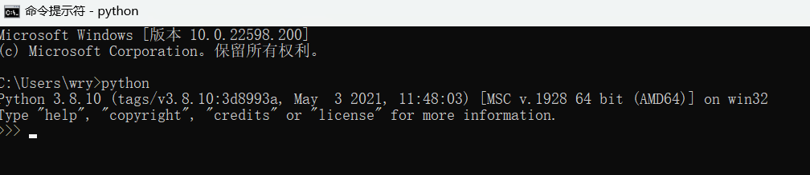

## 配置Anaconda

1. 开始 -> anaconda navigator可以成功启动，表明安装成功。

   开始 -> 右键点击anaconda prompt，以管理员身份运行。输入`conda list`，可以查看已经安装的包名和版本号。若结果正常显示，表明安装成功。

2. 点击进入Anaconda Prompt (Anaconda)。

3. 输入`conda --version`，检测conda环境。

   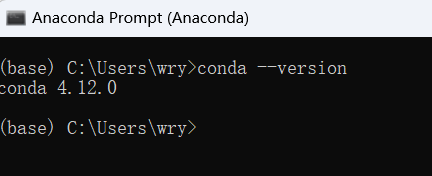

4. 输入`conda info`，查看是否成功。

   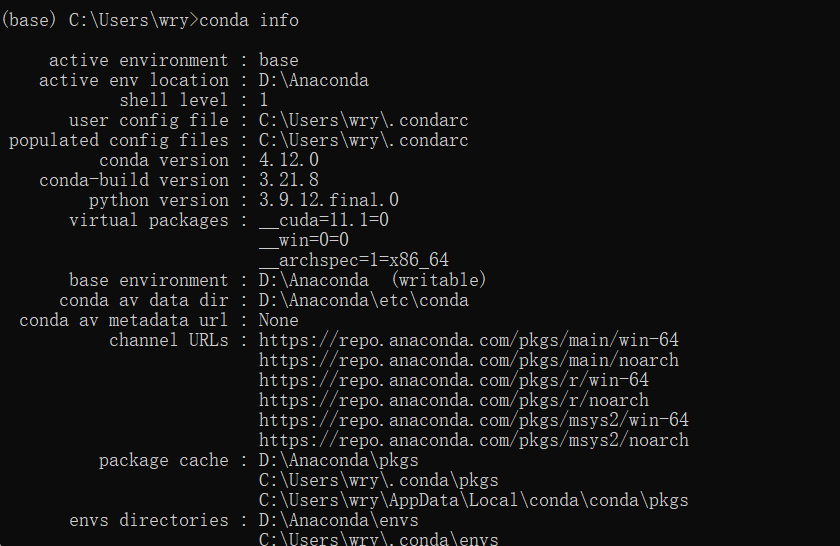

5. 输入`conda update conda`，更新conda包（国内网络即可）。

6. 输入`conda update --all`，更新所有包（国内网络即可）。

 

## 构建环境

1. 点击进入Anaconda Prompt (Anaconda)。

2. 输入`conda create -n iec_wry python=3.6.5`，创建基于python3.6.5版本的环境

3. 输入`conda env list`，查看环境列表（环境项目在*D:\Anaconda\envs*下）

   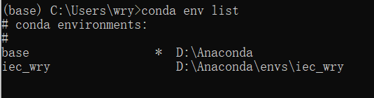

4. 输入`conda activate iec_wry`，激活环境

**Note：**

1. 如果要删除环境，输入`conda remove -n iec_wry --all`
2. 如果要查找环境下的包，在当前环境下输入`conda list`
3. 如果要安装包，`conda install package_name[=x.x.x]`或者`pip install package_name[=x.x.x]`
4. 如果要更新包，`conda update package_name`或者`pip update package_name`
5. 如果要卸载包，`conda uninstall package_name`或者`pip uninstall package_name`

## 其他问题

### 1. python环境没有激活

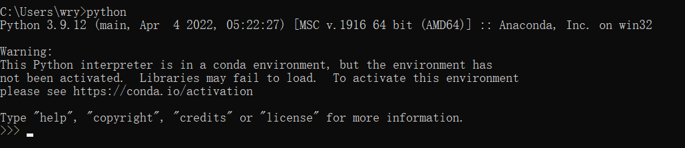

#### 解决（必须在base环境下才能使用此python）

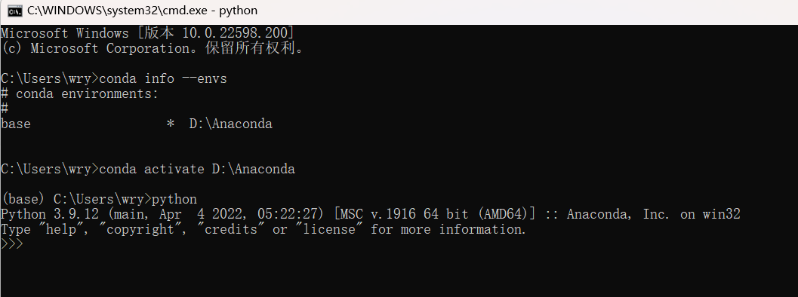

### 2. 没有Anaconda Navigator

#### 解决：[开始菜单中找不到anaconda navigator的解决办法](https://blog.csdn.net/qq_39530754/article/details/120693732)

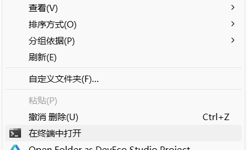

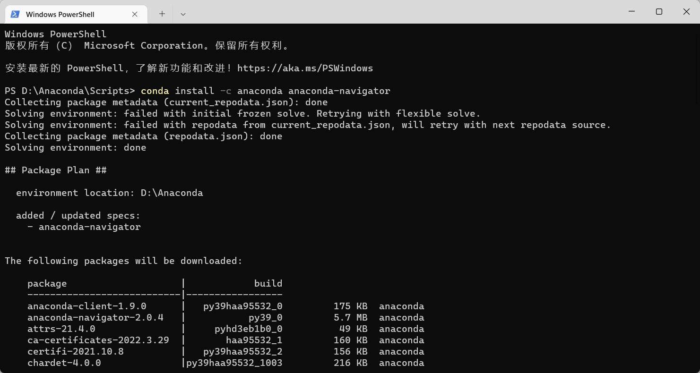

# 安装Ubuntu

## 1. 安装Ubuntu Serve

（[Ubuntu 18.04 LTS Server 版安装图文教程](https://blog.csdn.net/hhd1988/article/details/122552698)）

**注意：使用桥接模式-Realtek PCIe网卡**

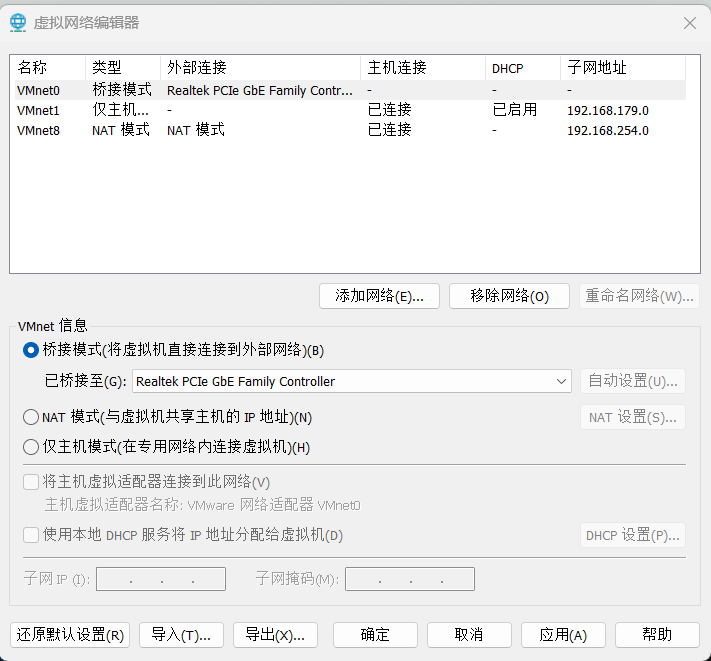

==**用户名：wry**==

==**密码：admin123**==

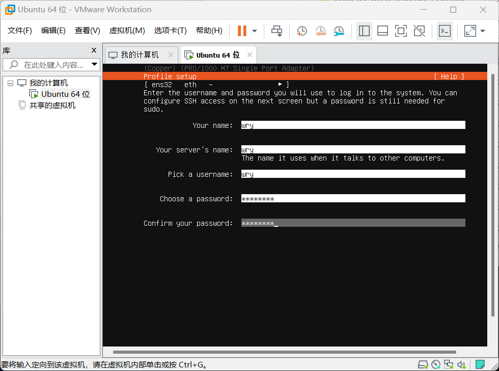

## 2. 检查ip地址：192.168.2.9

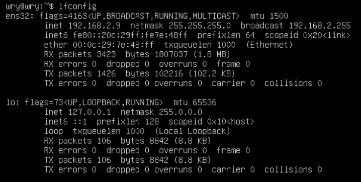

## 3. 配置ssh环境

（[ Ubuntu18配置连接xshell](https://blog.csdn.net/weixin_44246836/article/details/122894088)）

依次输入：`sudo apt install net-tools`		

​						`sudo apt-get install openssh-server`

​					   `sudo ufw allow 22`

## 4. 连接xshell和xftp

1. 连接xshell

   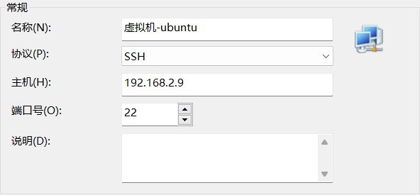

2. 连接xftp

   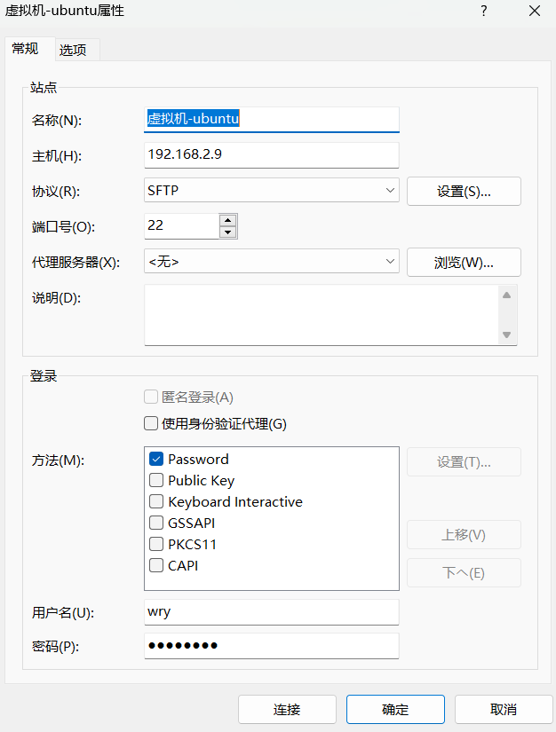

